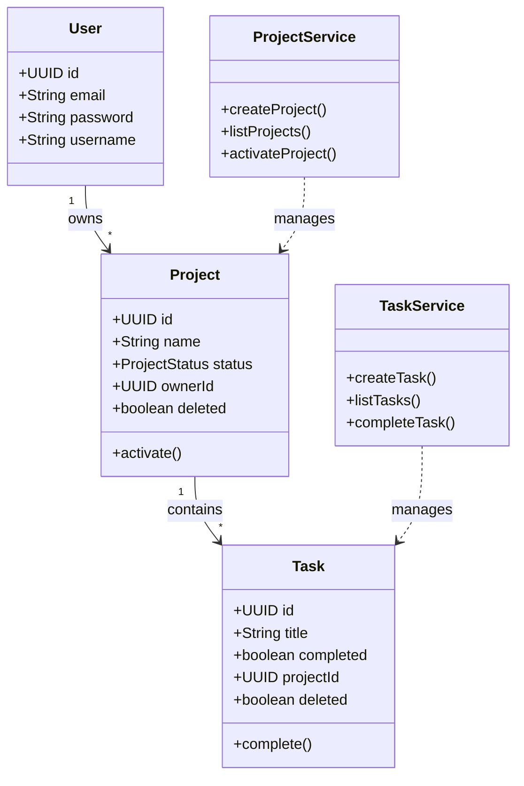
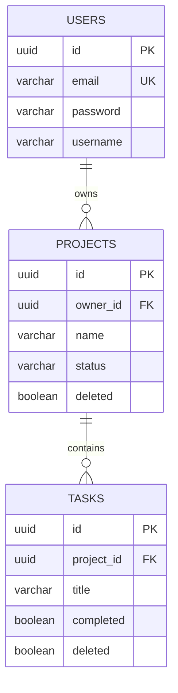

# Assessment - Project & Task Management System

Application developed with Java 17, Spring Boot 3 (Hexagonal Architecture), and Angular 17.

## Architecture
- **Hexagonal Architecture (Ports & Adapters)**:
  - **Domain**: Pure Java (No framework dependencies).
  - **Application**: Service layer implementing Use Cases.
  - **Infrastructure**: Spring Boot, JPA, Security, REST Adapters.
- **Frontend**: Angular 17 Standalone Components, Responsive Design (Poppins font).
- **Security**: JWT Authentication, Domain-driven Security Interfaces.

## Prerequisites
- Docker & Docker Compose
- Java 17+ (for local dev)
- Node.js 18+ (for local dev)
- **Supabase Account**: You need a running PostgreSQL instance.

## One-Command Execution (Docker)
1. Update `docker-compose.yml` with your Supabase credentials:
   ```yaml
   SPRING_DATASOURCE_URL=jdbc:postgresql://<HOST>:<PORT>/postgres
   SPRING_DATASOURCE_USERNAME=postgres
   SPRING_DATASOURCE_PASSWORD=your_password
   ```
2. Run:
   ```bash
   docker compose up --build
   ```
3. Access:
   - **Backend API**: http://localhost:8081
   - **Swagger UI**: http://localhost:8081/swagger-ui.html
   - **Frontend**: Not containerized by default, run locally (see below).

## Frontend Execution
1. Navigate to frontend:
   ```bash
   cd frontend
   npm install
   ```
2. Run:
   ```bash
   ng serve
   ```
3. Access: http://localhost:4200

## Test Credentials
(Register a new user via the interface or Swagger)
- **User**: `user@example.com`
- **Pass**: `password123`

## Technical Decisions
- **Supabase**: Selected for cloud-native PostgreSQL.
- **Hexagonal Strictness**: Domain logic is completely isolated. Even Security is behind a Port (`CurrentUserPort`, `PasswordEncoderPort`).
- **Angular Standalone**: Used modern Angular features for reduced boilerplate.

## System Diagrams

### Class Diagram (Domain)


### Use Case Diagram
```mermaid
usecaseDiagram
    actor User
    usecase "Register / Login" as UC1
    usecase "Create Project" as UC2
    usecase "View Projects" as UC3
    usecase "View Project Details" as UC4
    usecase "Create Task" as UC5
    usecase "Complete Task" as UC6
    usecase "Delete Task" as UC7

    User --> UC1
    User --> UC2
    User --> UC3
    User --> UC4
    User --> UC5
    User --> UC6
    User --> UC7
```

### Entity Relationship Diagram (MER)

